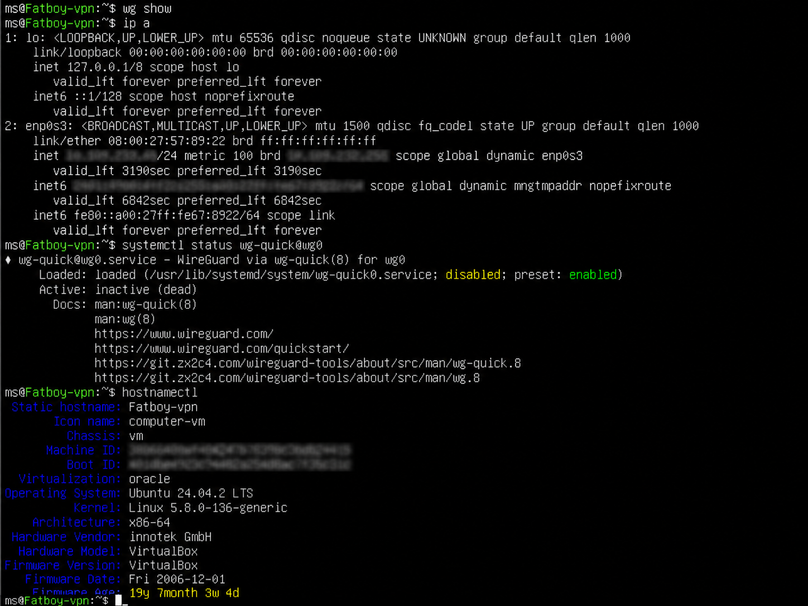
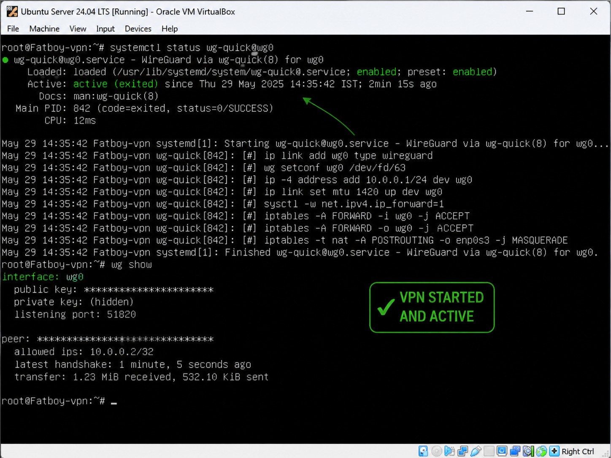

# 🔐 Fatboy VPN

> A self-hosted WireGuard VPN server built on Ubuntu Server inside VirtualBox.


---

# 📖 Overview

Fatboy VPN is my hands-on networking and Linux project where I built a secure WireGuard VPN server from scratch on Ubuntu Server running in VirtualBox.

The goal of this project was to understand how VPNs work beyond simply using them by configuring the server, generating cryptographic keys, enabling routing, and setting up firewall rules.

---

# 🚀 Technologies Used

- Ubuntu Server 24.04 LTS
- WireGuard
- Linux Terminal
- Bash
- VirtualBox
- iptables
- IPv4 Networking
- Secure Public/Private Key Cryptography

---

# 🛠 Features

- Secure WireGuard VPN
- Public/Private Key Authentication
- Ubuntu Server Deployment
- IP Forwarding
- NAT using iptables
- Virtualized Lab Environment
- Linux CLI Configuration

---

# 📂 Project Structure

```
Fatboy-VPN/
│
├── docs/
├── screenshots/
├── README.md
└── LICENSE
```

---

# ⚙️ Commands Used

```bash
sudo apt update
sudo apt install wireguard

wg genkey | tee server_private.key | wg pubkey > server_public.key

sudo nano /etc/wireguard/wg0.conf

sudo wg-quick up wg0

sudo wg show
```

---

# 🧠 What I Learned

- Linux Server Administration
- WireGuard VPN Configuration
- Secure Networking
- VPN Architecture
- Firewall Rules (iptables)
- IP Forwarding
- VirtualBox Networking
- Troubleshooting Linux Services

---

## 📸 Screenshots

### Ubuntu Server Hostname



---

### Starting WireGuard



---

### Ubuntu Server in VirtualBox


- Ubuntu Server
- WireGuard Interface
- VPN Status
- VirtualBox Environment

---

# 📈 Future Improvements

- Deploy on Oracle Cloud Always Free
- Configure Remote Clients
- QR Code Client Configuration
- Multi-device Support
- Automated Setup Script

---

# 👨‍💻 Author

**Mummidi Satish Sai Siddharth**

CSE Student

KL University

---

⭐ If you found this project interesting, consider giving it a star!